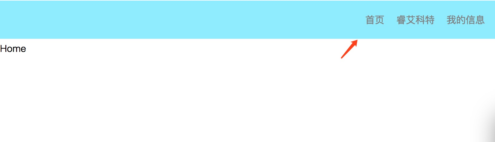
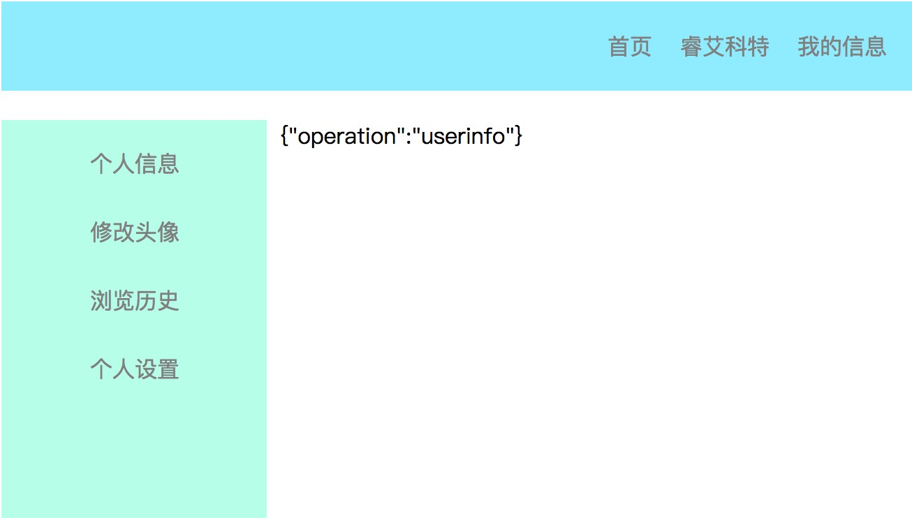

# 从0开始实现 react-router

react-router 已经经历了好几个版本的大更新。 在这里我们打算参照v4.0的设计思想 创一个轮子: tiny-router

### history api
现代浏览器提供了 提供了对history栈中内容的操作的[api](https://developer.mozilla.org/zh-CN/docs/Web/API/History_API)。 重要的有 pushState, replaceState。 
```javascript
var stateObj = { foo: "bar" };
history.pushState(stateObj, "page 2", "bar.html");
```
这将使浏览器地址栏显示为 http://xxxx/bar.html，但并不会导致浏览器加载 bar.html ，甚至不会检查bar.html 是否存在。

```javascript
var stateObj = { foo: "bar" };
history.replaceState(stateObj, "page 2", "bar.html");
```
这也将使浏览器地址显示 http://xxxx/bar.html， 也不会加载。 浏览器也不会检查bar.html 是否存在。 
pushState和replaceState的区别在于 回退的时候。 push是在history栈中加了一个记录， 而repalce是替换一个记录。 
这两个方法都接收3个参数， 分别是： 
1. 状态对象 — 状态对象state是一个JavaScript对象。
2. 标题
3. URL — 该参数定义了新的历史URL记录。新URL必须与当前URL同源。

### 监听url改变 
每当url改变的时候，视图view对应改变，就是一个基本的路由了。 通过history api可以很方便的修改url。 现在我们需要做的是监听每次url的改变，从而达到修改view的目的， 我们需要对history对象进行一些封装， 从而达到监听的目的。  代码如下：
```javascript
const his = window.history
class History {
    constructor() {
        this.listeners = []
    }

    push = path => {
        his.pushState({}, "", path);
        this.notifyAll()
    }

    listen = listener => {
        this.listeners.push(listener)
        return () => {
            this.listeners = this.listeners.filter(ele => ele !== listener)
        }
    }

    notifyAll = () => {
        this.listeners.forEach(lis => {
            lis()
        })
    }
}

export default new History()
```
声明一个History类， 可以注册listener， 当push一个地址的时候， History类底层调用history.push 方法去修改路由， 然后通知注册的listener。 这样在路由改变的时候，我们的处理函数就可以第一时间的进行处理了。 

### Route
react-router v4.0 里面最重要的组件莫过于Route。 这个组件接收一个path属性， 一旦url和path匹配， 就展示这个Route指定的组件。页面上一次可以展示出多个Route组件，只要Route的path属性和url匹配。 
我们的Route 是一样的。 为了实现这个效果， 我们需要在每次url变化的时候检测新的url和path是否匹配,一旦匹配，就展示对应的组件。这就需要每个Route组件在初始化的时候在History上注册一个监听器， 从而让Route可以及时的响应url变化 
代码如下： 
```javascript
class Route extends Component {
    constructor(props) {
        super(props)
        this.state = {
            match: matchPath(...)
        }
        this.unlisten = history.listen(this.urlChange)
    }

    componentWillUnmount() {
        this.unlisten()
    }

    urlChange = () => {
        const pathname = location.pathname
        this.setState({
            match: matchPath(...)
        })
    }

    render() {
        const { match } = this.state
        if(!match) return

        // 具体的渲染...
    }
}
```
#### matchPath 
Route的path 可以是字符串或者正则表达式。 除此之外Route还有 exact（精确匹配）， strict（结尾/）， sensitive(大小写)这3个属性。 他们共同决定了一个匹配url的正则表达式PathReg（这里的匹配规则和react-router是完全一样的）。 

我们假定path， exact， strict， sensitive属性是不可改变的（实际上来说， 也的确没有修改它们的必要）。 这样话， 我们就可以在Route组件初始化的时候生成这个PathReg。 
```javascript
const compilePath = (pattern = '/', options) => {
    const { exact = false, strict = false, sensitive = false } = options
    const keys = []
    const re = pathToRegexp(pattern, keys, { end: exact, strict, sensitive })
    return { re, keys }
}

class Route extends Component {
    static propTypes = {
        path: PropTypes.string,
        component: PropTypes.func,
        render: PropTypes.func,
        exact: PropTypes.bool,
        strict: PropTypes.bool,
    }

    constructor(props) {
        super(props)

        this.pathReAndKeys = compilePath(props.path, {
            exact: props.exact,
            strict: props.strict,
            sensitive: props.sensitive
        })
        this.state = {
            match: matchPath(...)
        }
        this.unlisten = history.listen(this.urlChange)
    }
 }
```
我们在组件的constructor里面， 预先生成了pathReAndKeys。
然后在每次matchPath的时候， 直接使用这个正则。 mathPath的代码如下： 
```javascript
const matchPath = (pathname, props, pathReAndKeys) => {
    const { path = '/', exact = false } = props
    const { re, keys } = pathReAndKeys
    const match = re.exec(pathname)

    if (!match)
        return null

    const [ url, ...values ] = match
    const isExact = pathname === url

    if (exact && !isExact)
        return null

    return {
        path, // the path pattern used to match
        url: path === '/' && url === '' ? '/' : url, // the matched portion of the URL
        isExact, // whether or not we matched exactly
        params: keys.reduce((memo, key, index) => {
            memo[key.name] = values[index]
            return memo
        }, {})
    }
}
```
当路由不匹配的时候， 直接返回null。 否则返回一个匹配信息的对象。 例如：

| url        | path   |  match.params  |
| --------   | -----:  | :----:  |
| /user      | /user  |  {}     |
| /user/12        |   /user/:id   |   {id: '12'}   |
| /user/12/update        |    /user/:id/:op    |  {id: 12, op: 'update'}  |


这里处理路径用了[path-to-regexp](https://github.com/pillarjs/path-to-regexp) 这个库。 

#### 渲染
匹配路径只是过程， 渲染出对应的view才是最终的目标！Route组件提供了 3个属性： component， render， children。 具体用法如下： 
```javascript
// one
class A extends Component {
    render() {
        return <div>A</div>
    }
}

// Route默认会把匹配的信息注入到组件A的props
<Route path='/a' component={A} /> 

// two
<Route path='/a' render={({match}) => (<div>A</div>)}

// three Route默认会把匹配的信息注入到组件A的props
<Route>
    <A>
</Route>
```
完整的Route 代码如下： 
```javascript
import React, { Component } from 'react'
import PropTypes from 'prop-types'
import { compilePath, matchPath } from './util'
import history from './history'

class Route extends Component {
    static propTypes = {
        path: PropTypes.string,
        component: PropTypes.func,
        render: PropTypes.func,
        exact: PropTypes.bool,
        strict: PropTypes.bool,
    }

    constructor(props) {
        super(props)

        this.pathReAndKeys = compilePath(props.path, {
            exact: props.exact,
            strict: props.strict,
            sensitive: props.sensitive
        })
        this.state = {
            match: matchPath(location.pathname, props, this.pathReAndKeys)
        }
        this.unlisten = history.listen(this.urlChange)
    }

    componentWillReceiveProps(nextProps) {
        const {path, exact, strict} = this.props
        if (nextProps.path !== path || nextProps.exact !== exact || nextProps.strict !== strict) {
            console.warn("you should not change path, exact, strict props")
        }
    }

    componentWillUnmount() {
        this.unlisten()
    }

    urlChange = () => {
        const pathname = location.pathname
        this.setState({
            match: matchPath(pathname, this.props, this.pathReAndKeys)
        })
    }

    render() {
        const { match } = this.state
        if(!match) return

        const { children, component, render } = this.props

        if (component) {
            const Comp = component
            return <Comp match={match}/>
        }
        if (render) {
            return render({ match })
        }

        return React.cloneElement(React.Children.only(children), { match })
    }
}

export default Route
```

### Link
与react-router相同。 我们同样提供一个Link组件， 来实现 “声明式”的路由跳转。 
Link本质上来说就是一个原生的a标签， 然后在点击的时候history.push到to属性所指定的地址去。
```javascript

import React, { Component } from 'react'
import history from './history'

export default class Link extends Component {

    handleClick = e => {
        const { onClick, to } = this.props
        if (onClick){
            onClick(e)
        }

        e.preventDefault()
        history.push(to)
    }

    render() {
        return (
            <a  {...this.props} onClick={this.handleClick}/>
        )

    }
}
```

### 一个 ‘复杂’ 的例子
这里有一个网站，它模拟了通常业务场景下的路由跳转。 路由由tiny-router管理的。 

首页 导航在页头点击切换


个人信息页 在左侧导航切换


[live demo](https://ykforerlang.github.io/tiny-react-example-curdop/)
### Github & npm
1. github 地址：*https://github.com/ykforerlang/tiny-router*。 觉得不错，点个star
2. 安装 `npm install tinyy-router` (注意是 tinyy 两个y，因为tiny-router已经被使用了)


